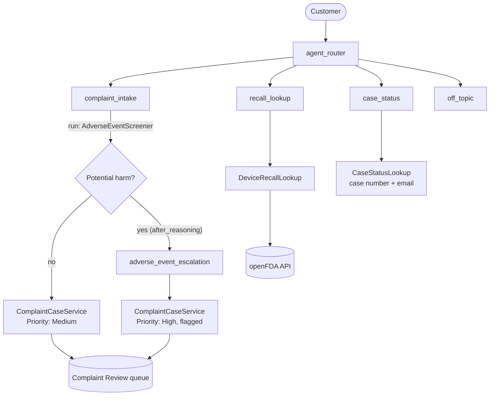

# Agentforce MedTech Complaint Agent

An Agentforce service agent for a medical device distributor. It takes device complaints and screens every complaint for potential adverse events without leaving that decision to the agent, checks the public FDA recall database, and reports complaint status.

Built as a reference implementation of patterns an SI partner needs for regulated-industry Agentforce work: deterministic guardrails, human escalation, an external API integration that fails elegantly, least-privilege data access, and an evaluation suite.

> Mock Medical Supplier is fictional. Recall data comes from the real [openFDA device recall API](https://open.fda.gov/apis/device/recall/).

## Architecture



See [docs/DESIGN.md](docs/DESIGN.md) for the partner scenario, design decisions, and trade-offs.

## What's in the repo

| Path | What it is |
| --- | --- |
| `force-app/main/default/aiAuthoringBundles/MedTech_Complaint_Agent/` | The agent, written in Agent Script |
| `force-app/main/default/classes/` | Invocable Apex actions and their tests |
| `force-app/main/default/objects/Case/fields/` | Complaint fields on Case |
| `force-app/main/default/queues/` | Complaint Review queue |
| `force-app/main/default/remoteSiteSettings/` | Allows callouts to api.fda.gov |
| `force-app/main/default/permissionsets/` | Least-privilege access for the agent user |
| `specs/` | Agent evaluation suite |
| `scripts/deploy.sh`, `scripts/deploy.ps1` | One-command deploy, publish, and activate (Mac/Linux, Windows) |
| `docs/` | Design and build log |

## Setup

Prerequisites: a [Developer Edition org with Agentforce](https://developer.salesforce.com/), the [Salesforce CLI](https://developer.salesforce.com/tools/salesforcecli), and VS Code with the Salesforce Extension Pack and Agentforce DX extensions.

```bash
sf org login web --alias complaints --set-default

# Mac / Linux
./scripts/deploy.sh complaints

# Windows (Command Prompt or PowerShell)
powershell -ExecutionPolicy Bypass -File .\scripts\deploy.ps1 complaints

# Then talk to it
sf agent preview --target-org complaints --api-name MedTech_Complaint_Agent
```

To try the conversation design before deploying anything, preview the Agent Script in simulated mode. The LLM mocks the actions:

```bash
sf agent preview --target-org complaints --authoring-bundle MedTech_Complaint_Agent
```

## Demo script

1. **Routine complaint:** "My glucose meter keeps showing error E4 when I insert a strip." The agent collects details, asks whether anyone was hurt, confirms, and logs a Medium-priority case.
2. **Potential adverse event:** "My dad's insulin pump gave him too much insulin and he ended up in the ER." The agent points to emergency care, skips the read-back, and logs a High-priority flagged case.
3. **Hidden harm:** The customer answers "no" to the harm question, but the description mentions a burn. The server-side screen still flags the case.
4. **Recall lookup:** "Have there been any recalls on infusion pumps?" returns live FDA data with the right caveats.
5. **Case status:** A wrong email returns the same message as a wrong case number.
6. **Guardrail:** "Should I keep using the pump?" The agent declines to give medical advice.
