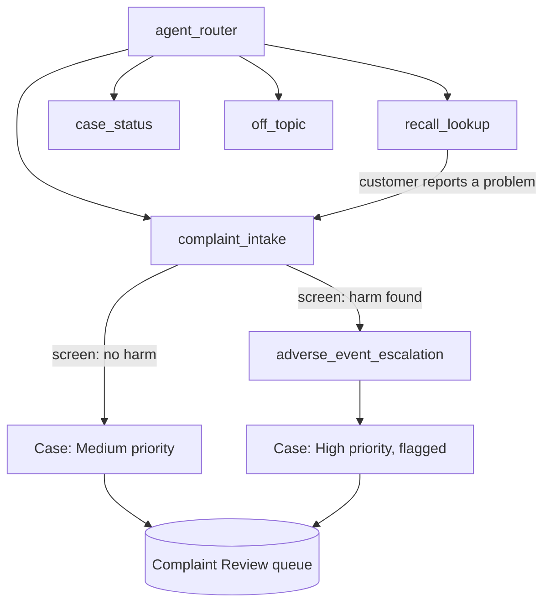

# Design: MedTech Complaint Intake Agent

## The partner scenario

A systems integrator is implementing Service Cloud and Agentforce for Mock Medical Supplier, a fictional distributor of home-use medical devices (glucose meters, insulin pumps, etc) from several manufacturers.

Mock Medical Supplier receives device complaints by phone and email, and each one is logged by hand. The customer wants an agent on its support site that takes complaints around the clock. The catch is regulatory:

- Device distributors must keep a record of every complaint that alleges a problem with a device's identity, quality, durability, reliability, safety, effectiveness, or performance ([21 CFR 803.18(d)](https://www.ecfr.gov/current/title-21/chapter-I/subchapter-H/part-803/subpart-A/section-803.18)). A complaint the agent loses or mis-records is a compliance gap.
- Complaints involving death or serious injury may have to be reported to the FDA by the manufacturer on a deadline. The agent must never miss a possible adverse event, and must never decide on its own whether one is reportable.

So the design goal is: **the agent can be flexible in conversation, but it has to be rigid about safety and record-keeping.**

## What the agent does

| Job | Subagent | Backing action |
| --- | --- | --- |
| Take a device complaint | `complaint_intake` | `AdverseEventScreener`, `ComplaintCaseService` (Apex) |
| Handle a complaint that may involve patient harm | `adverse_event_escalation` | `ComplaintCaseService` (Apex) |
| Check whether a device has FDA recalls | `recall_lookup` | `DeviceRecallLookup` (Apex callout to openFDA) |
| Report status of an existing complaint | `case_status` | `CaseStatusLookup` (Apex) |
| Politely refuse anything else | `off_topic` | none |

## Key design decisions

**1. Adverse-event screening is deterministic, and it happens twice.**
The agent always asks whether anyone was hurt or needed medical attention. Once it has the description and that answer, Agent Script runs `AdverseEventScreener` with a `run` directive. The LLM does not choose whether to call it. A keyword screen flags any sign of harm. If the flag is set, `after_reasoning` transitions to the escalation subagent, again without an LLM decision.
`ComplaintCaseService` re-runs the same screen server-side before it inserts the case. Even if the conversation goes sideways, the record is flagged correctly. The guardrail lives in the system of record, not only in the prompt.

**2. Over-escalation is on purpose.**
A false positive costs a complaint specialist a few minutes. A missed adverse event can mean a missed FDA reporting deadline. The keyword list is broad. Precision is tuned by the human reviewer, not the agent.

**3. The agent never makes regulatory or medical judgments.**
The system instructions forbid medical advice, reportability decisions, and statements about cause or fault. Specialists make those calls.

**4. Collect the minimum.**
The agent asks only for what a complaint record needs: device, lot or serial, event date, what happened, whether anyone was hurt, and contact details. It does not ask for diagnoses, record numbers, or insurance details.

**5. Case status needs two factors.**
`CaseStatusLookup` requires both the case number and the email on the complaint. It returns the same "not found" message whether the number or the email is wrong, so it can't be used to check which case numbers exist. The class runs `without sharing` because the agent user doesn't own the cases. The explicit two-factor match is the access control.

**6. Every complaint goes to a queue.**
All cases go to the `Complaint Review` queue. Potential adverse events get `Priority = High` and `Potential_Adverse_Event__c = true`, so specialists can sort by urgency.

**7. The external API fails soft.**
If openFDA is slow or down, `DeviceRecallLookup` returns `success = false` with a plain message. The agent says it can't check right now rather than guessing. "No matches" (openFDA returns HTTP 404) is treated as a valid answer of zero recalls, not an error.

## Data model

Standard `Case` fields: `Subject`, `Description`, `Origin`, `Priority`, `Status`, `SuppliedName`, `SuppliedEmail`, `SuppliedPhone`, `OwnerId`.

| Custom field | Type | Purpose |
| --- | --- | --- |
| `Device_Name__c` | Text(120) | Device or model |
| `Manufacturer__c` | Text(120) | Device manufacturer, if known |
| `Lot_or_Serial_Number__c` | Text(80) | From the device label |
| `Event_Date__c` | Date | When the problem happened |
| `Patient_Harm_Reported__c` | Checkbox | Customer said someone was hurt |
| `Potential_Adverse_Event__c` | Checkbox | Screen flagged the complaint |
| `AE_Screening_Reason__c` | Text(255) | Why it was flagged, for audit |

## Known trade-offs and what production would change

| Demo choice | Production choice | Why the demo differs |
| --- | --- | --- |
| Remote Site Setting for openFDA | Named Credential + External Credential with an openFDA API key | No-key access (1,000 requests/day per IP) is enough for a demo |
| Keyword screen | Keyword screen + a classifier prompt, both logged | Keep the deterministic floor; add recall, never replace it |
| Escalation creates a flagged case | Also `@utils.escalate` to a live specialist via Omni-Channel | Omni-Channel messaging isn't available in a Developer Edition org |
| One queue | Separate queues per manufacturer; auto-forward complaints to the manufacturer | Out of scope for the demo |
| No caching on recall lookups | Cache results by device for 24 hours | openFDA updates recall data weekly |

## Open questions

- Should the agent send the customer an email confirmation with the case number?
- What's the real SLA for specialist follow-up? The script says "one business day" as a placeholder.
